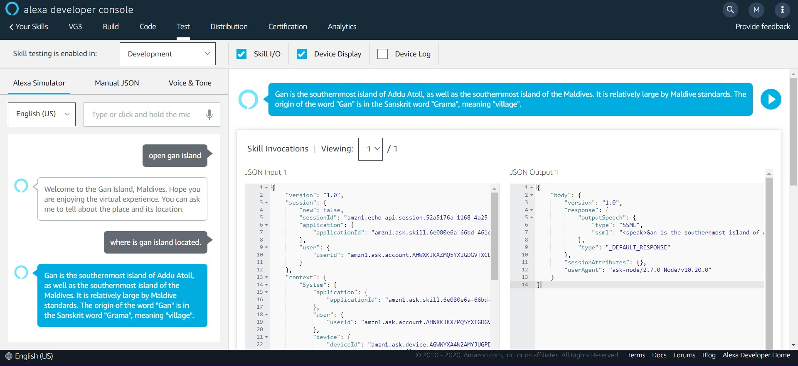
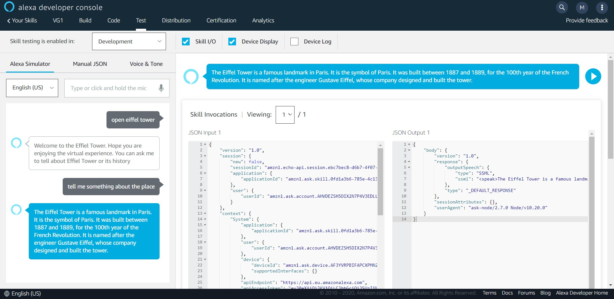
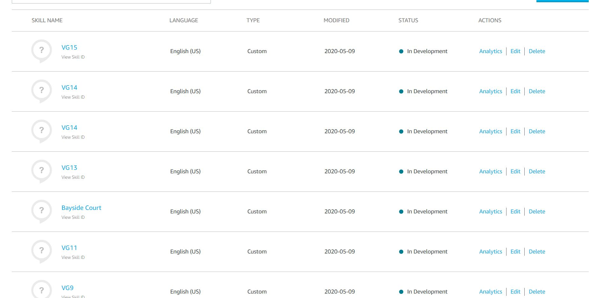

# XploVR - a virtual travel experience

>Explore the world even during this pandemic

We know how the outbreak of **COVID-19** has created a global health crisis that has had a deep impact on the way we perceive our world and our everyday lives. Everyone is working from home and are adviced not to go out and stay inside.

## About the app
Many people had to cancle their vacation plans due to this pandemic. So we came up with a solution for this problem. Our product is a **Virtual Reality experience** which can allow people to **virtually visit various international locations all over the World** which they couldn't visit due to the outbreak. Go to places, get to know about these locations.
## Features:
* Virtually visit locations all around the world.
* App tells the user about the history of the location they visit.
* It also provides them with the necessary information about the location.
* User can ask questions related to the location and get response within the app (using Alexa Skills).

## Tech Stack:
* Unity3D
* GoogleVR
* Alexa

## Alexa-Skills

## Links:
* [Download App](https://drive.google.com/file/d/1Gq7LWtqNps0AYHN14icCCSoSty_YAUmH/view?usp=drivesdk)
* [Website](https://github.com/soilshubham/XploVR)
* [Video Demo](#)

## Contributors ✨

Thanks goes to these wonderful people
<table>
  <tr>
    <td align="center"><a href="https://github.com/soilshubham"> <b>Sahil Shubham</b></a> </td>
    <td align="center"><a href="https://github.com/moit-bytes"> <b>Mohit Kumar</b></a> </td>
    <td align="center"><a href="https://github.com/niteshbharti005101"> <b>Nitesh Bharti</b></a> </td>
</table>
